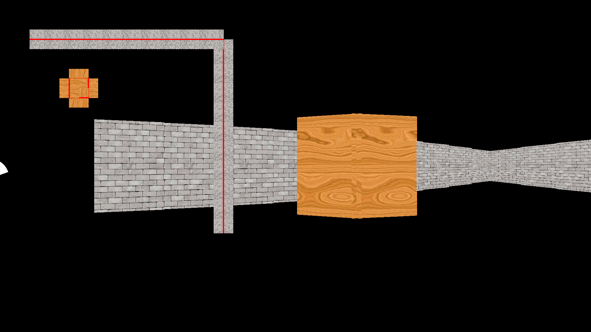

# Dotnet Raycast Demo

## Description

A fake 3D environment created using raycasting

Here you can see a small minimap of the level as well as the rendered 3D:

## Dependencies

 - libcsfml-dev

 - dotnet core 3.1 sdk

## Build

Run `make <os>=1` where '<os>' can be LINUX, WIN32, or WIN64
